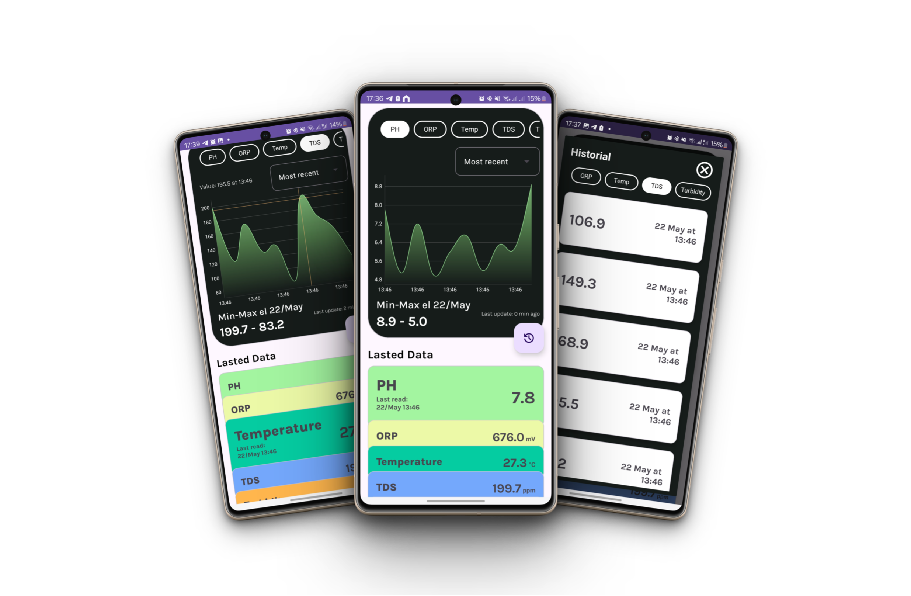

# Hydrosense - Android App

Android application designed to visualize real-time environmental sensor data obtained from the [Hydrosense API](https://github.com/VicentCodes/HydroSenseApi) also available in my repositories. Data is collected and processed from sensors measuring parameters such as pH, TDS (total dissolved solids), temperature, ORP (oxidation-reduction potential) and water turbidity. The application allows viewing these data in interactive graphs and performing analysis at different time intervals.

## Key Features

- **Real-time Data Visualization**: View real-time readings from sensors measuring pH, TDS, temperature, ORP, and turbidity.
- **Interactive Charts**: Display dynamic charts with historical data and the ability to view maximum, minimum, and real-time updates.
- **Time Range Filters**: Filter data by different time ranges (e.g., last 24 hours, last week) and automatically update the charts.
- **Local Synchronization**: The app uses local storage to cache data, enabling it to function even without an internet connection.
- **User-friendly Interface**: Designed with Material Design components like `ChipGroup`, `Snackbar`, and `AutoCompleteTextView` for an optimal user experience.

## Technologies Used

- **Kotlin**: Primary programming language.
- **MPAndroidChart**: For data visualizing it in graphs.
- **Gson**: Used for JSON parsing and data deserialization.
- **Volley**: For making HTTP requests to the RESTful API and handling responses.
- **SharedPreferences**: For caching data and reducing network requests.
- **Room (Optional)**: Could be used for persistent local data storage.
- **Material Design**: Components like `ChipGroup`, `Snackbar`, and `AutoCompleteTextView` for a clean, intuitive UI.

## Performance Optimizations
- **Data Caching**: The app uses SharedPreferences to cache sensor data locally, reducing the need for repeated network calls.
- **Efficient JSON Parsing**: We use Gson to efficiently parse the JSON response and manage data in a memory-friendly way.
- **Lazy Loading**: RecyclerView ensures that only visible items are loaded into memory, improving app performance for large datasets.

## Future Improvements
- **Offline Data Sync**: Implement a better offline data sync mechanism to store readings while offline and sync them automatically when internet connectivity is restored.
- **Better Error Handling**: Improve error handling when the app is unable to fetch data (e.g., show retry options).

## License

This project is licensed under the [MIT License](LICENSE), meaning you are free to use, modify, and distribute the code with appropriate attribution.

